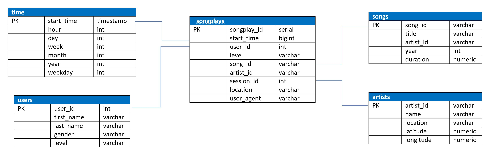

# Data Modeling with Postgres

## Project Description

The purpose of this project is to create a Postgres database for Sparkify, who wants to be able to analyst data they've collected on songs and user activity.  Sparkify wants to gain an understanding of what songs their users are listening to, but they currently don't have a way to query the data they need.

In this project, we create a database schema and ETL pipeline to aid in the analysis, since there is currently no database schema that exists. We will be using two datasets described below, and other project files and templates provided (also listed below).
We will be restructuring Sparkify log files into a relational database that will create an optimized environment to run queries and efficiently obtain valuable information about user trends.

## Project Datasets

* Song Dataset:  This is a subset, in JSON format, of real data from the Million Song Dataset.  The file contains the artist and metadata about a song.  The files provided are partitioned by the first three letters of each song's track ID.

* Log Dataset: This dataset contains log files, also in JSON format, generated by an event simulator.  The log files are based on the songs in the song dataset, and simulate activity logs form a music streaming app.  These files are partitioned by year and month.

## Song Play Analysis Schema

For this project, we used a star schema, which consists of one single, large fact table and several smaller dimentional tables.  In this schema, "songplays" is the fact table, storing transactional data and measured data.  The fact table sits at the senter of the star schema database. The tables to the left and right of the "songplays" table are the dimentional tables, which store attributes about the different types of data.  The data stored in dimentional table supplement or support the data contained in the fact table.

## Steps to Run

1. To begin, you will have to create the database and tables by running the "create_tables.py" file.  The code to run this file is included in code cell #2 of the "etl.ipynb" notebook. You may need to run this code more than one time as you navigate through the different sections, which is fine.  However, make sure that you close out the existing connection to the database by running code cell #23 before you run the create_tables.py file in order to avoid database access errors.

2. As you run through each section of the code, you can confirm that it's working by using the corresponding sections in the "test.ipynb" notebook. For example, when you run the code to add a record to the artists table, you should run the cell in the test notebook that counts the records in the "artists" table. NOTE: Make sure to click "Restart kernel" to close the connection to the database after running this notebook.

3. Once you confirm that the process for loading, extracting and inserting the data is working properly, run "etl.py" to run the process completely for all records/files.

